# Virtual Academic Affair API


## Package Information

- Name: `nestjs-auth-starter`
- Version: `0.0.1`
- License: `UNLICENSED`
- Runtime: `Node.js 18+`

## Introduction

This project is a NestJS-based backend platform for academic affairs operations that ingests institutional email traffic, routes requests into business modules, and supports automated classification and response workflows.

- Syncs emails from Gmail to database
- Automatically classifies emails using NLP (Natural Language Processing)
- Auto-applies labels to emails on Gmail based on classification
- Routes emails to appropriate business modules for handling academic affairs

## Installation

1. **Install dependencies:**

```bash
npm install
```

2. **Start services (PostgreSQL, RabbitMQ, Redis):**

```bash
docker-compose up -d
```

3. **Configure environment variables:**
   - Create `.env` file based on `.env.example`
   - Configure database, RabbitMQ, Google OAuth credentials

4. **Run application:**

```bash
# Development mode
npm run start:dev

# Production mode
npm run start:prod
```

5. **Access:**
   - API: http://localhost:3000
   - Postman Collections: `http/` (root directory)

##


